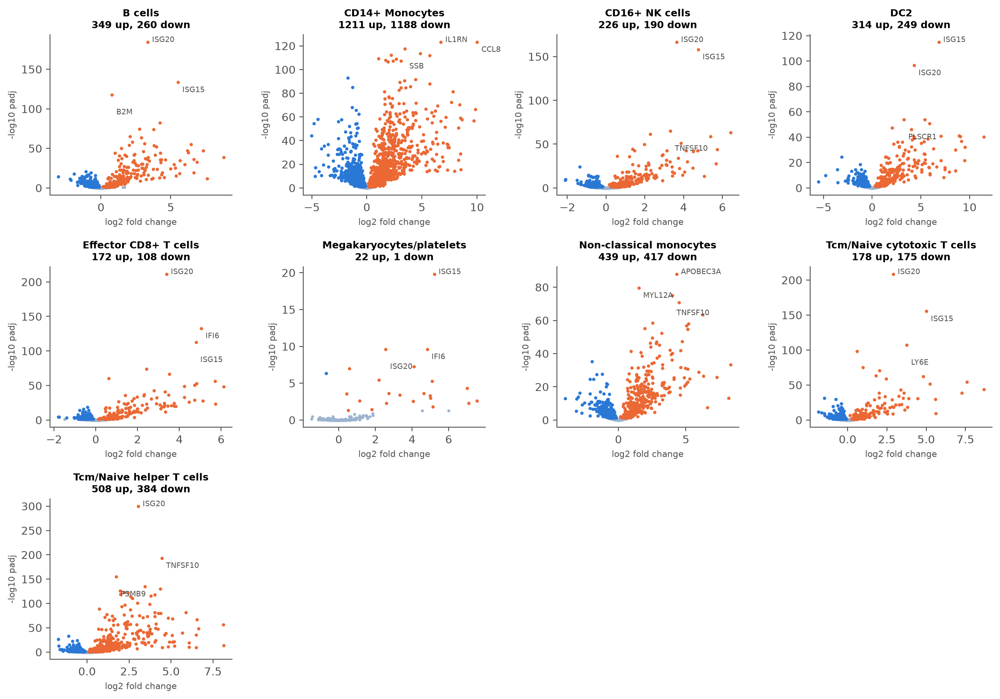

# Agentic Single-Cell RNA-seq Analysis

An LLM agent (Claude) that runs a single-cell RNA-seq analysis from raw counts to a written
report, choosing each step and threshold from the data and recording every decision it makes.



*From the [Kang et al. 2018 example](examples/kang/report.md): the agent's comparison of
interferon-stimulated and control blood cells from 8 patients, per cell type.*

## What makes it different

- **It decides from the data.** QC cutoffs, doublet handling, batch correction, cell-type
  labels and the statistical design are chosen by the agent after reading what each tool
  reports. Each report shows every choice next to the standard default.
- **It checks its own work.** It confirms cell-type labels against marker genes before
  accepting them, and every number in its report is filled in by code, not typed by the model.
- **It is measured.** On PBMC3k, 5 repeated runs made identical decisions and matched the
  published cell types for 94.9% of cells, at about $0.20 per run
  ([benchmark](benchmarks/README.md)).

## Examples

| Example | What it shows |
|---|---|
| [IFN-β vs control PBMCs](examples/kang/report.md) | Comparing two conditions across 8 donors; correcting mislabelled cell types |
| [PBMC3k](examples/pbmc3k/report.md) | The standard workflow on a single sample |
| [Two-batch PBMCs](examples/pbmc_multibatch/report.md) | Integrating two sequencing runs |

Each folder also has the agent's decision log, the prompt it was given, and the run's cost.

## Running it

You'll need [`uv`](https://docs.astral.sh/uv/) and an Anthropic API key
(`export ANTHROPIC_API_KEY=...`).

```bash
uv sync
uv run python scripts/fetch_pbmc3k.py
uv run python run.py prompts/pbmc3k.txt
```

Results (report, figures, annotated `.h5ad`, decision log) go to `outputs/`. The other
examples have their own fetch script in `scripts/` and prompt file in `prompts/`. Tests run
offline with `uv run pytest`.
