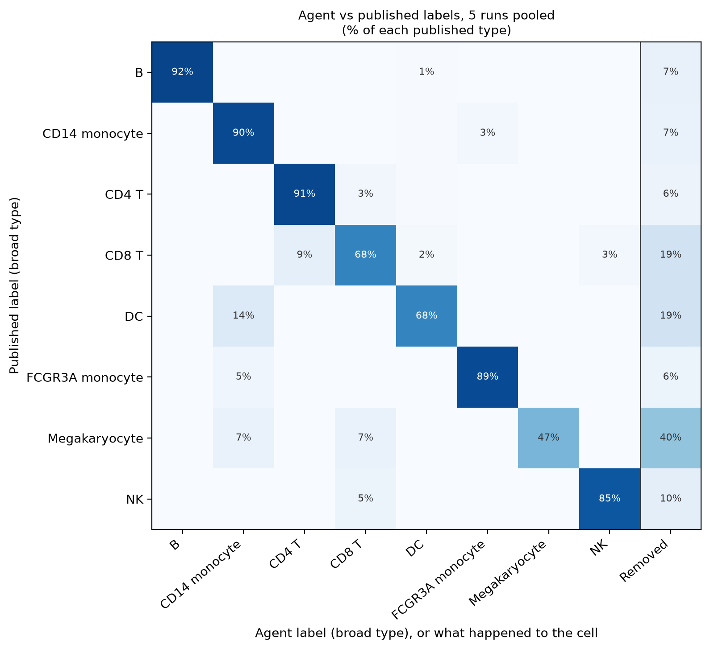

# Agentic Single-Cell RNA-seq Analysis

This is a small project where an LLM (Claude) runs a single-cell RNA-seq analysis. Each tool
hands back a summary of what it found; the model reads that, picks the next tool and the
parameters to call it with, and writes up the results at the end. The step order and the
thresholds come from the model, not from a script. Code-level guardrails stop it breaking the
workflow's rules, and every call is logged.

The point was to see how much of a real analysis an LLM can drive, and to keep the mechanism
visible: the loop is a short, plain function against the raw API, not a framework.

## Example: interferon-β stimulated vs. control PBMCs

[Kang et al. (2018)](https://www.nature.com/articles/nbt.4042) split blood cells from 8 lupus
patients into a control and an IFN-β stimulated half. Given that description and the raw
counts, the agent took the data through QC, integration and annotation, then compared the two
conditions per cell type:


*Stimulated vs. control, per cell type (PyDESeq2, paired by donor). Interferon-stimulated genes
such as ISG15 and ISG20 are up in every cell type; CD14+ monocytes respond most.*

Full report: [`examples/kang/report.md`](examples/kang/report.md).

## What it decides

From the Kang run:

- **Doublets.** The prompt says the authors already removed most doublets by genotype, so the
  agent judged the usual cutoff (which would flag ~10% of cells) too aggressive: it would cut
  real stimulated cells. In this run it kept all cells; in others it removed only the clearest
  1.4%. It ran the doublet model per 10x run, not per donor, because all donors were pooled
  into each run.
- **Integration.** It corrected for donor × condition so each cell type lines up across
  conditions, noting that this only changes the embedding: the comparisons use raw counts.
- **Fixing labels.** CellTypist called the monocytes "macrophages" (these cells were cultured
  for 6 hours) and some platelets "T cells". The agent looked up canonical markers (CD14, LYZ,
  PPBP, PF4, FOXP3, ...) and relabelled 6 clusters, citing the evidence. It also rejected a
  "regulatory T cell" label because FOXP3 was expressed in under 1% of those cells.
- **Statistics.** It compared conditions per donor, not per cell: a paired pseudobulk design
  (`~ donor + condition`) for expression and a paired test for cell-type proportions. It
  flagged that condition and 10x run are the same thing here, so a run effect can't be ruled out.

On simpler data it makes simpler choices: on PBMC3k (one run, no batches) it picks PCA and keeps
the standard thresholds; on a two-batch dataset it integrates the batches with scVI.

## How the report stays honest

- A **decisions table** at the top of each report compares each standard default with what
  the agent chose and what that did. It is built by code from the decision log.
- **Every number in the report comes from code.** The agent writes placeholders such as
  `{{doublet.threshold}}` or `{{gene:CD14+ Monocytes:ISG15}}`; the report is rejected if it
  contains a number the model typed itself.
- **Figures, captions and Methods are generated by code**, so they describe what actually ran.
- The **decision log** (`tool_calls.jsonl`) records every tool call, the arguments the agent
  chose and the summary it read back.

## Benchmark

On PBMC3k, 5 repeated runs against the published cell types
([`benchmarks/`](benchmarks/README.md)):

| | Result |
|---|---|
| Same decisions (method, thresholds, clusters, labels) | 5 of 5 runs |
| Agreement with published labels | 94.9% of cells (ARI 0.90) |
| Cost per run | about $0.20 |



*Where each published cell type ended up. "Removed" is cells taken out by the agent's QC or
doublet filter: mostly megakaryocytes, which are often mistaken for doublets.*

## Examples

| Folder | Data | What it shows |
|---|---|---|
| [`examples/kang`](examples/kang/report.md) | IFN-β vs control, 8 donors | Condition comparison, label fixing, integration across conditions |
| [`examples/pbmc3k`](examples/pbmc3k/report.md) | PBMC3k, one 10x run | The basic arc: QC, PCA, clustering, annotation |
| [`examples/pbmc_multibatch`](examples/pbmc_multibatch/report.md) | Two separate 10x runs | Batch integration with scVI, a data-driven mitochondrial cutoff |

Each folder has the report and figures, the decision log, the prompt the agent was given, and
the run's token use and cost (`usage.jsonl`).

## Running it

You'll need [`uv`](https://docs.astral.sh/uv/) and an Anthropic API key.

```bash
uv sync                                      # install dependencies

echo 'export ANTHROPIC_API_KEY=sk-ant-...' >> ~/.zshenv && source ~/.zshenv

uv run python scripts/fetch_pbmc3k.py        # download the example data
uv run python run.py prompts/pbmc3k.txt      # run the agent
```

A run is driven by a prompt file that names the dataset and says what to do with it; it is
copied into the run's output folder. For the other examples:

```bash
uv run python scripts/fetch_kang.py
uv run python run.py prompts/kang.txt

uv run python scripts/fetch_pbmc_multibatch.py
uv run python run.py prompts/pbmc_multibatch.txt
```

As it runs you'll see its reasoning and the tools it calls. Results go to `outputs/`: the
report, the figures, the annotated `.h5ad`, and the decision log. A PBMC3k run costs about
$0.20 and takes about 2 minutes; Kang about $0.35–0.70 and 15 minutes (mostly scVI training).

## Layout

```
agent/
  loop.py       # the loop that talks to Claude and runs tools
  tools.py      # the analysis tools (each returns a summary)
  report.py     # the code-built parts of the report: decisions table, figures, Methods
  schemas.py    # tool descriptions Claude sees, and the name-to-function map
  prompts.py    # the instructions given to the agent
  session.py    # holds the dataset and saves checkpoints
  config.py     # model name, prices, seed, paths
prompts/        # one prompt file per example
scripts/        # fetch the example datasets
benchmarks/     # repeated runs, scoring, and results
tests/          # fast offline tests (no API, no downloads): uv run pytest
run.py          # entry point
examples/       # saved example runs, one folder per dataset
```
