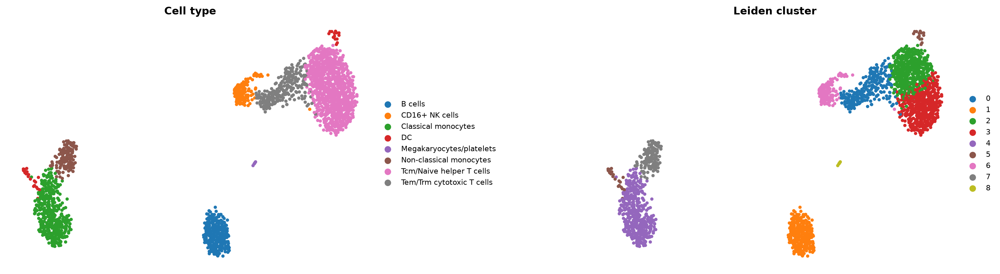
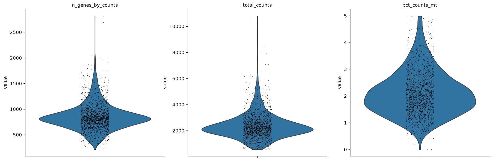

# PBMC3k Single-Cell RNA-seq Analysis Report

## Overview
This report summarizes the end-to-end analysis of the PBMC3k dataset (peripheral blood mononuclear cells, 10x Genomics), starting from raw counts and proceeding through QC, doublet removal, normalization, dimensionality reduction, clustering, and cell-type annotation.

## 1. Dataset Inspection
- **Input:** 2,700 cells × 32,738 genes, raw counts present, no additional obs metadata, no batch key detected (`candidate_batch_key = null`).
- Gene identifiers are human gene **symbols** (e.g., MIR1302-10, FAM138A), confirmed by `check_gene_identifiers`, which also detected the mitochondrial gene prefix **"MT-"** (13 mito genes found), consistent with a human PBMC sample.
- Since only a single batch is present, batch-correction methods (scVI) were not warranted; PCA is the simpler, appropriate choice for dimensionality reduction.

## 2. Quality Control
Per-cell QC metrics computed on 2,700 cells:
- **n_genes_by_counts:** median 817 (range 212–3422)
- **total_counts:** median 2197 (range 548–15,844)
- **pct_counts_mt:** median 2.03% (range 0–22.6%)

Tutorial-standard thresholds were recommended and applied, as they fit this dataset well:
- `min_genes = 200` (removed 0 cells; the natural minimum was already 212)
- `max_pct_mt = 5.0%` (removed 57 cells with elevated mitochondrial fraction, indicative of stressed/dying cells)
- `min_cells = 3` (removed 19,041 genes detected in fewer than 3 cells, reducing noise/sparsity)

**Result:** 2,700 → 2,643 cells; 32,738 → 13,697 genes.

## 3. Doublet Detection and Removal
Scrublet was run on the filtered matrix. The doublet-score distribution was **not bimodal** (no clear valley), so per protocol the **median + 3×MAD** rule was used rather than a fixed cutoff or the Scrublet automatic threshold (which would have been more permissive at 0.227).
- Median score: 0.044; MAD-based threshold: **0.10**
- Cells flagged at this threshold: 222 (8.4%), a plausible doublet rate for a droplet-based 10x run.

**Result:** 2,643 → 2,421 cells after removing predicted doublets (score ≥ 0.10).

## 4. Normalization
Raw counts were stashed prior to normalization (required for potential downstream raw-count-based methods). Data were then:
- Total-count normalized to 10,000 counts/cell
- Log1p transformed
- 2,000 highly variable genes (HVGs) flagged for downstream analysis

## 5. Dimensionality Reduction
Since the dataset contains a single, clean batch (no batch key), **PCA** was used (scVI was not needed). 50 principal components were computed; the top PC explains 10.3% of variance, with cumulative variance of 31.2% across the top 10 PCs — typical for scRNA-seq data with many small distinct axes of variation.

## 6. Clustering
Leiden clustering (resolution = 1.0) on the PCA representation yielded **9 clusters**, ranging in size from 7 to 550 cells. UMAP coordinates were computed for visualization.

## 7. Marker Genes and Cell-Type Annotation
Wilcoxon rank-sum tests identified marker genes per cluster, and CellTypist (Immune_All_Low model) with majority voting assigned cell-type labels per cluster. Marker genes and annotations show strong concordance:

| Cluster | Top Markers | Annotated Cell Type | N cells |
|---|---|---|---|
| 0 | CCL5, NKG7, GZMA, CST7, CD3D | Tem/Trm cytotoxic T cells | 260 |
| 1 | CD74, CD79A, HLA-DRA, CD79B, MS4A1 | B cells | 315 |
| 2 | LTB, IL32, LDHB, IL7R, CD3D | Tcm/Naive helper T cells | 515 |
| 3 | RPS12, RPS6, RPL32, RPS27, RPS3A | Tcm/Naive helper T cells | 550 |
| 4 | LYZ, S100A9, S100A8, TYROBP, FCN1 | Classical monocytes | 446 |
| 5 | CD74, HLA-DRB1, HLA-DRB5, GAPDH, ACTB | DC | 41 |
| 6 | GNLY, NKG7, GZMB, PRF1, CTSW | CD16+ NK cells | 140 |
| 7 | LST1, FCER1G, AIF1, COTL1, FCGR3A | Non-classical monocytes | 147 |
| 8 | PF4, GNG11, PPBP, SDPR, SPARC | Megakaryocytes/platelets | 7 |

**Overall cell-type composition (n = 2,421 cells):**
- Tcm/Naive helper T cells: 1,065 (44.0%)
- Classical monocytes: 446 (18.4%)
- B cells: 315 (13.0%)
- Tem/Trm cytotoxic T cells: 260 (10.7%)
- Non-classical monocytes: 147 (6.1%)
- CD16+ NK cells: 140 (5.8%)
- DC: 41 (1.7%)
- Megakaryocytes/platelets: 7 (0.3%)

Marker genes strongly support these calls: canonical T cell markers (CD3D/CD3E/IL7R/IL32) drive clusters 0/2/3, B cell markers (CD79A/CD79B/MS4A1) drive cluster 1, monocyte markers (LYZ/S100A8/S100A9/FCN1 for classical; FCGR3A/LST1 for non-classical) drive clusters 4/7, cytotoxic/NK markers (GNLY/NKG7/GZMB/PRF1) drive cluster 6, and platelet markers (PF4/PPBP/GNG11) uniquely and cleanly mark the small cluster 8.

Note: Cluster 3 shows predominantly ribosomal protein genes as top markers (RPS12, RPS6, RPL32, etc.) alongside its Tcm/Naive helper T cell CellTypist call — this is common in high-quality, transcriptionally "quiet" naive T cells and is consistent with the annotation rather than indicating a QC problem.

## 8. Conclusion
The analysis recovered the expected major PBMC populations (T cell subsets, B cells, monocyte subsets, NK cells, dendritic cells, and a small platelet/megakaryocyte population) with clear, biologically coherent marker gene support. QC and doublet filtering removed a modest fraction of low-quality/ambiguous cells (2,700 → 2,421, ~10.3% total attrition), consistent with standard expectations for this well-characterized benchmark dataset. Final annotated results, UMAP, and QC figures accompany this report.

## Figures

