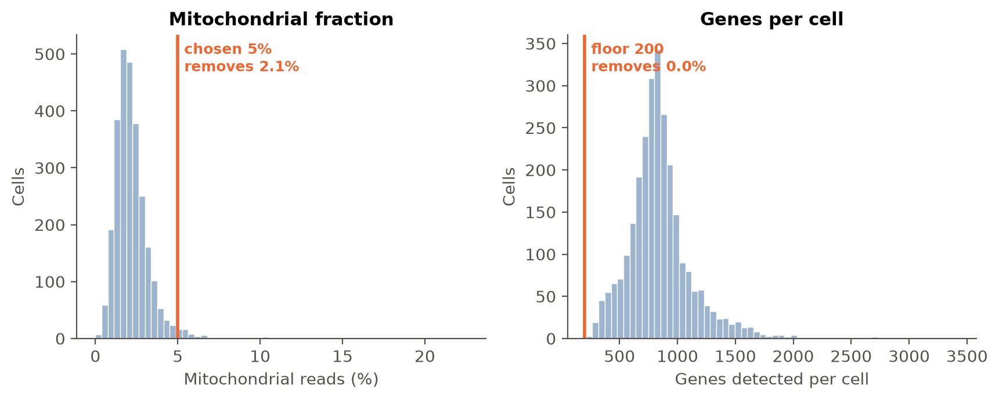
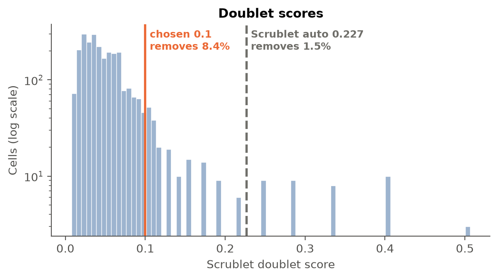
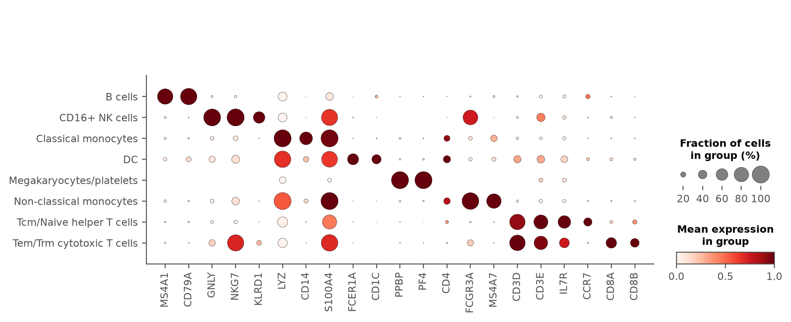
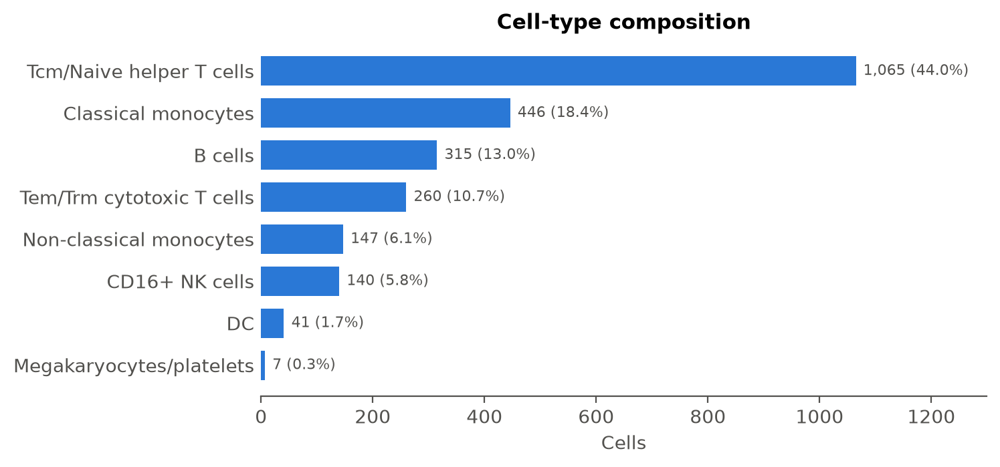

# Single-cell RNA-seq analysis: pbmc3k

**pbmc3k** · 2,700 → 2,421 cells · 9 clusters · 8 cell types · PCA embedding

## Overview

This report covers the standard scRNA-seq processing and annotation of a PBMC sample from a single healthy donor, sequenced in a single 10x Genomics run (no batch key, no condition to compare). Starting from 2,700 cells and 32,738 genes, the workflow proceeded through QC filtering, doublet removal, normalization, PCA, Leiden clustering, and CellTypist-based annotation, ending with 2,421 high-quality cells assigned to 8 cell types.

## Key analysis decisions

Each row compares a standard default with what the agent chose after reading the data. Built from the tool log (`tool_calls.jsonl`), not written by the model.

| Step | Standard default | What the data showed | Agent's choice | Effect |
|---|---|---|---|---|
| Mitochondrial cutoff | 5% | median 2.03%; default would remove 57 of 2,700 cells (2.1%) | 5% (default kept) | 57 cells removed by QC (2.1%) |
| Cell and gene floors | ≥200 genes/cell, genes in ≥3 cells | fewest genes in a cell: 212 | ≥200 genes/cell, genes in ≥3 cells (default kept) | 19,041 genes removed |
| Doublet threshold | Scrublet automatic (0.227) | scores not bimodal; median + 3×MAD 0.1 | **0.1** (median + 3×MAD) | 222 cells removed (8.4%) |
| Normalisation | 10,000 counts/cell, 2,000 HVGs | — | 10,000 counts/cell, 2,000 HVGs (default kept) | 2,000 HVGs flagged |
| Embedding | PCA | no batch column | PCA | 50 components |
| Leiden resolution | 1.0 | — | 1.0 (default kept) | 9 clusters |
| Annotation model | Immune_All_Low | — | Immune_All_Low (default kept) | 8 cell types |

## Quality control

Gene identifiers were confirmed as human gene symbols, with 13 mitochondrial genes detected using the `MT-` prefix. Per-cell QC metrics were unremarkable for a healthy PBMC sample: median genes/cell 817, median UMI counts/cell 2,197, and median mitochondrial fraction 2.03% (p95 4.01%, max 22.6%).

The recommended tutorial-default thresholds (min genes/cell 200, max mitochondrial % 5%, min cells/gene 3) fit this dataset well: the gene-count floor removed no additional cells (all cells already exceeded it), while the mitochondrial cap removed 57 cells (2.1%) that were consistent with stressed or dying cells at the upper tail of the mito-percent distribution. Filtering left 2,643 cells and 13,697 genes (genes detected in fewer than 3 cells were dropped as uninformative).

*Per-cell QC before filtering (2,700 cells, median 2.03% mitochondrial). The standard 5% mitochondrial cutoff was kept and removes 57 cells (2.1%). Minimum genes per cell: 200, which removes 0 cells (fewest observed: 212).*

## Doublet detection

Scrublet was run on the full (single-run) dataset. The doublet-score distribution was not bimodal, so per the standard rule I used median + 3×MAD (0.1) rather than a bimodal valley or a fixed cutoff. This is a plain 10x run with no upstream doublet removal (e.g., no genotype demultiplexing or hashing mentioned), so the stricter statistical threshold is appropriate rather than a more permissive one. This flagged and removed 222 cells (8.4% of the QC-passed population), in line with the expected doublet rate for a standard 10x run at this cell loading. After this step 2,421 cells remained.

*Scrublet doublet scores for 2,643 cells; the distribution is not bimodal. Chosen threshold 0.1 (median + 3×MAD) flags 222 cells (8.4%). Scrublet's automatic threshold (dashed, 0.227) would flag 39.*

## Dimensionality reduction

Because this dataset comes from a single donor and a single sequencing run with no batch structure, PCA on the normalized, log-transformed, highly-variable-gene matrix (2,000 HVGs) is the appropriate and simplest choice — batch-correction methods like scVI are unnecessary here and would add complexity without benefit. The top PC captured 10.3% of variance, with a steady drop-off across subsequent components, consistent with several biologically distinct discrete cell populations plus continuous variation within them.

## Clustering

Leiden clustering at resolution 1.0 on the PCA embedding produced 9 clusters, ranging from 7 to 550 cells. The UMAP below shows well-separated clusters consistent with the major PBMC lineages.

| Cluster | Cells | Top marker genes | Cell type |
|---|---|---|---|
| 0 | 260 | CCL5, NKG7, B2M, GZMA, CST7 | Tem/Trm cytotoxic T cells |
| 1 | 315 | CD74, CD79A, HLA-DRA, CD79B, HLA-DPB1 | B cells |
| 2 | 515 | LTB, IL32, LDHB, IL7R, CD3D | Tcm/Naive helper T cells |
| 3 | 550 | RPS12, RPS6, RPL32, RPS27, RPS3A | Tcm/Naive helper T cells |
| 4 | 446 | LYZ, S100A9, S100A8, TYROBP, FCN1 | Classical monocytes |
| 5 | 41 | CD74, HLA-DRB1, HLA-DRB5, GAPDH, ACTB | DC |
| 6 | 140 | GNLY, NKG7, GZMB, PRF1, CTSW | CD16+ NK cells |
| 7 | 147 | LST1, FCER1G, AIF1, COTL1, FCGR3A | Non-classical monocytes |
| 8 | 7 | PF4, GNG11, PPBP, SDPR, SPARC | Megakaryocytes/platelets |

*UMAP of 2,421 cells computed on PCA, coloured by cell type and Leiden cluster.*

## Cell-type annotation

CellTypist (Immune_All_Low.pkl, fine-grained model) assigned each cluster a label by majority vote, cross-checked against the coarse Immune_All_High.pkl model as a second opinion; the two agreed at the expected level of granularity in every cluster. I additionally verified canonical markers for every final cell type with `check_markers`:

- **Tem/Trm cytotoxic T cells** (cluster 0): CD8A and CD8B were strongly and specifically enriched together with high CD3D/CD3E and cytotoxic genes (NKG7, GZMA), confirming a CD8+ effector/memory T-cell identity.
- **B cells** (cluster 1): CD79A and MS4A1 were both essentially specific to this cluster and strongly depleted elsewhere, with CD3D depleted here, confirming B-cell identity.
- **Tcm/Naive helper T cells** (clusters 2 and 3): both clusters show high CD3D/CD3E and IL7R with low CD8A/CD8B, consistent with CD4+ T helper cells; cluster 3 shows markedly higher CCR7 than cluster 2, suggesting it skews more naive while cluster 2 skews more memory-like, but both fall under the same fine CellTypist label and were kept as one annotation given the shared core T-helper markers.
- **Classical monocytes** (cluster 4): LYZ and CD14 were both strongly and specifically enriched, the canonical classical-monocyte signature.
- **DC** (cluster 5): FCER1A and CD1C were both specifically enriched here and essentially absent elsewhere, confirming conventional dendritic cells rather than monocytes despite shared HLA-DR/CD74 expression with the monocyte/B-cell clusters.
- **CD16+ NK cells** (cluster 6): GNLY, NKG7, KLRD1 and FCGR3A were all strongly and specifically enriched, and CD3D was near-absent, confirming NK identity over the alternative "ILC" label suggested by the coarse model — ILCs would not be expected to co-express this cytotoxic/FCGR3A program.
- **Non-classical monocytes** (cluster 7): FCGR3A and MS4A7 were both strongly and specifically enriched together with high LYZ, the canonical non-classical (CD16+) monocyte signature, distinguishing it from cluster 4's classical monocytes (which are CD14-high, FCGR3A/MS4A7-low).
- **Megakaryocytes/platelets** (cluster 8): PPBP and PF4 were both essentially universally expressed in this small cluster and essentially absent elsewhere, the canonical platelet/megakaryocyte marker pair.

No relabeling was necessary: in every case the CellTypist label matched the marker evidence and the two reference models agreed at their respective resolutions.

Final cell-type composition:

| Cell type | Cells | Share |
|---|---|---|
| Tcm/Naive helper T cells | 1,065 | 44.0% |
| Classical monocytes | 446 | 18.4% |
| B cells | 315 | 13.0% |
| Tem/Trm cytotoxic T cells | 260 | 10.7% |
| Non-classical monocytes | 147 | 6.1% |
| CD16+ NK cells | 140 | 5.8% |
| DC | 41 | 1.7% |
| Megakaryocytes/platelets | 7 | 0.3% |
| **Total** | **2,421** | |

Major populations: 1,325 cells (54.7%) T cells, 446 cells (18.4%) classical monocytes, 315 cells (13.0%) B cells, 140 cells (5.8%) NK cells, 147 cells (6.1%) non-classical monocytes, 41 cells (1.7%) dendritic cells, and 7 cells (0.3%) megakaryocytes/platelets — a composition typical of healthy human PBMCs.

*Top 5 marker genes per Leiden cluster (Wilcoxon rank-sum). Dot size: fraction of cells expressing; colour: mean expression scaled per gene.*

*Canonical markers checked by the agent before accepting or changing labels (21 of 22 shown), ordered by the cell type each marks most, so the enriched dots run down the diagonal. A gene is shown if, in at least one type, padj < 0.05, log2FC > 1 and it is expressed in at least 25% of cells. Dot size: fraction of cells expressing; colour: mean expression scaled per gene. Not enriched in any type: NCAM1.*

*Cells per annotated type (2,421 cells, 8 types; CellTypist majority vote over Leiden clusters).*

*Top 5 marker genes per cell type (Wilcoxon rank-sum). Dot size: fraction of cells expressing; colour: mean expression scaled per gene.*

## Caveats

- Clusters 2 and 3 were both annotated as "Tcm/Naive helper T cells" by CellTypist; the CCR7 gradient between them suggests a naive/memory continuum rather than two discrete cell types, and a higher clustering resolution could resolve this further if finer CD4 subsetting were of interest.
- The dendritic cell cluster (41 cells (1.7%)) and especially the megakaryocyte/platelet cluster (7 cells (0.3%)) are small, so marker statistics for these populations are based on limited cell numbers and should be interpreted with appropriate caution.
- This is a single donor with no replicate structure or experimental condition, so no composition or differential-expression comparison was performed; all findings describe this one sample.

## Conclusions

QC, doublet removal, and clustering proceeded smoothly for this clean single-run PBMC dataset, yielding 2,421 cells across 9 clusters that map onto 8 well-supported, canonical PBMC cell types — T-cell subsets, B cells, classical and non-classical monocytes, dendritic cells, NK cells, and megakaryocytes/platelets — each confirmed by specific, enriched canonical markers rather than by CellTypist label alone.

## Methods

*Generated from the tool log: these are the steps and parameters that actually ran.*

**Quality control.** Per-cell metrics were computed with scanpy `calculate_qc_metrics`; mitochondrial genes were those prefixed `MT-` (13 found).

**Filtering.** Cells with fewer than 200 detected genes or more than 5% mitochondrial reads were removed, as were genes detected in fewer than 3 cells (2,700 → 2,643 cells, 32,738 → 13,697 genes).

**Doublets.** Doublet scores were computed with Scrublet (scanpy `pp.scrublet`) on raw counts; cells scoring ≥ 0.1 were removed (222 cells, 8.4%).

**Normalisation.** Raw counts were kept in `layers['counts']`; expression was scaled to 10,000 counts per cell and log1p-transformed. The top 2,000 highly variable genes were flagged.

**Embedding.** PCA (50 components) on the highly variable genes.

**Clustering.** A k-nearest-neighbour graph on that embedding was clustered with Leiden (resolution 1.0; 9 clusters) and embedded with UMAP.

**Markers and annotation.** Marker genes per cluster were ranked with a Wilcoxon rank-sum test. Cell types were assigned with CellTypist (model `Immune_All_Low.pkl`), using majority voting over the Leiden clusters.

### Software

| Software | Version |
|---|---|
| Python | 3.11.14 |
| scanpy | 1.11.5 |
| anndata | 0.12.19 |
| numpy | 2.4.6 |
| scipy | 1.17.1 |
| celltypist | 1.7.1 |
| LLM (analysis decisions and narrative) | claude-sonnet-5 |

### Reproducibility

Random seed 0 for all stochastic steps. Every tool call, with the arguments the agent chose and the summary it read back, is in `tool_calls.jsonl`. The agent's choices are sampled from the model, so a re-run can take different decisions.

---

*This report was produced by an AI agent (claude-sonnet-5). The run summary, decisions table, figures, captions and Methods are generated by code from the tool log; the narrative is written by the model and should be checked against them before use.*
