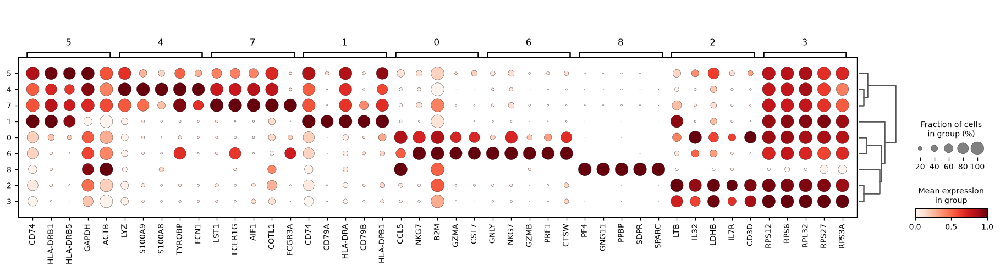
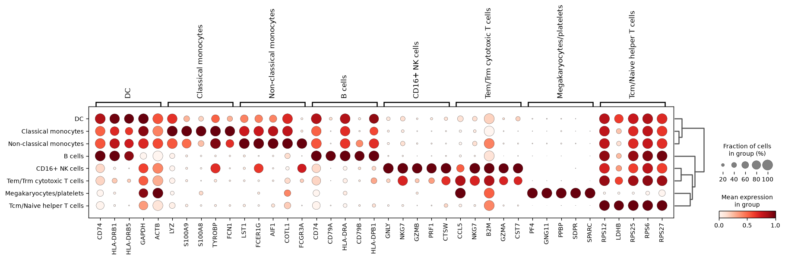

# PBMC3k Single-Cell RNA-seq Analysis Report

## Overview
Starting AnnData: 2700 cells x 32738 genes (raw counts, no batch metadata — single sample, single batch). Gene identifiers were confirmed as human gene symbols with the standard `MT-` mitochondrial prefix.

## Quality Control
Per-cell QC metrics were computed (n_genes, total_counts, pct_counts_mt). The distribution was typical of PBMC 10x data: median ~817 genes/cell and ~2197 counts/cell, with mitochondrial fraction median 2.0% but a long tail to 22.6%.

**Thresholds applied** (tutorial-standard, validated against this dataset's distribution):
- Minimum 200 genes/cell (removed 0 cells — all cells already exceeded this floor)
- Maximum 5% mitochondrial reads (removed 57 high-mito cells, consistent with the p95=4.0%/p99=5.9% distribution — a clean cutoff isolating a small stressed/dying-cell tail)
- Minimum 3 cells per gene (removed 19,041 lowly-detected genes)

Result: **2643 cells x 13,697 genes** after filtering.

## Doublet Detection
Scrublet was run on the filtered matrix. The doublet-score distribution was **not bimodal** (no clear valley), so per protocol the threshold was set using **median + 3×MAD = 0.10**, flagging 222 cells (8.4%) — a plausible doublet rate for a standard 10x droplet run. These 222 cells were removed.

Result: **2421 cells** retained for downstream analysis.

## Normalization & Dimensionality Reduction
Raw counts were stashed, then data were total-count normalized (target_sum=1e4), log1p-transformed, and the top 2000 highly variable genes flagged.

Since `inspect_dataset` reported **no batch key** (single clean batch), **PCA** was the appropriate choice over scVI — simpler and sufficient absent any batch-correction need. PCA was run with 50 components (PC1 explains 10.3% of variance; top 10 PCs cumulatively explain 31.2%).

## Clustering
Leiden clustering on the PCA representation (resolution=1.0) yielded **9 clusters**, ranging from 7 to 550 cells, with UMAP coordinates computed for visualization.

## Marker Genes & Cell-Type Annotation
Wilcoxon rank-sum marker identification per cluster, combined with CellTypist (Immune_All_Low model, majority vote per cluster), gave highly concordant results:

| Cluster | Size | Top Markers | Annotated Cell Type |
|---|---|---|---|
| 0 | 260 | CCL5, NKG7, GZMA, CST7, CD3D | Tem/Trm cytotoxic T cells |
| 1 | 315 | CD74, CD79A, HLA-DRA, CD79B | B cells |
| 2 | 515 | LTB, IL32, IL7R, CD3D, CD3E | Tcm/Naive helper T cells |
| 3 | 550 | RPS12, RPS6, RPL32, RPS27 (ribosomal-high) | Tcm/Naive helper T cells |
| 4 | 446 | LYZ, S100A9, S100A8, FCN1 | Classical monocytes |
| 5 | 41 | CD74, HLA-DRB1, HLA-DRB5 | DC |
| 6 | 140 | GNLY, NKG7, GZMB, PRF1 | CD16+ NK cells |
| 7 | 147 | LST1, FCER1G, FCGR3A, AIF1 | Non-classical monocytes |
| 8 | 7 | PF4, GNG11, PPBP, SDPR | Megakaryocytes/platelets |

Final overall cell-type composition (n=2421 cells):
- Tcm/Naive helper T cells: 1065 (44.0%)
- Classical monocytes: 446 (18.4%)
- B cells: 315 (13.0%)
- Tem/Trm cytotoxic T cells: 260 (10.7%)
- Non-classical monocytes: 147 (6.1%)
- CD16+ NK cells: 140 (5.8%)
- DC: 41 (1.7%)
- Megakaryocytes/platelets: 7 (0.3%)

Marker genes are canonical and unambiguous for each lineage: CD3D/IL7R/LTB for T cells, CD79A/CD74/MS4A1 for B cells, LYZ/S100A8/S100A9/FCN1 for classical monocytes, FCGR3A/LST1 for non-classical monocytes, GNLY/GZMB/PRF1/NKG7 for NK cells, and PF4/PPBP/GNG11 for platelets. Cluster 3, dominated by ribosomal protein genes, was classified with the neighboring T-cell cluster (2) as Tcm/Naive helper T cells — high ribosomal content is common in resting/naive lymphocytes and is consistent with T-cell identity rather than indicating a technical artifact, given the absence of elevated mitochondrial or stress markers in this cluster.

## Conclusion
This analysis reproduces the expected PBMC3k cell-type landscape: a majority of T cells (both cytotoxic and helper/naive subsets), a substantial monocyte compartment (classical and non-classical), B cells, NK cells, a small dendritic cell population, and a very small megakaryocyte/platelet population — all consistent with canonical human peripheral blood mononuclear cell composition. QC filtering (mitochondrial %, gene count) and doublet removal were applied conservatively using data-driven thresholds, retaining 2421 of 2700 original cells (89.7%) for the final annotated dataset.

## Figures

