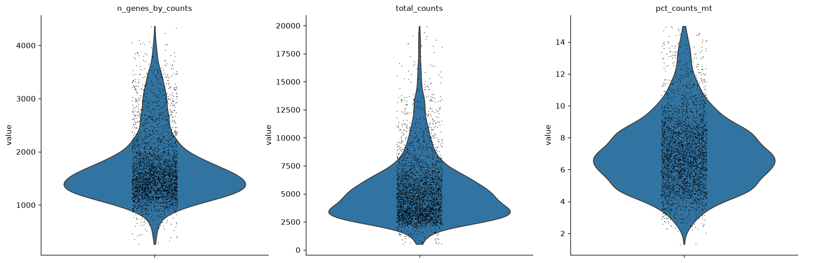

# PBMC Multi-Batch scRNA-seq Analysis Report

## Overview
Starting data: 4,000 cells × 15,792 genes (raw counts available), with a genuine two-level `batch` covariate (`n_batches = 2`) in `obs`, indicating this dataset requires batch-aware integration.

## 1. Gene Identifiers
Gene symbols were confirmed as human HGNC symbols (e.g., *NOC2L*, *LINC00115*). The mitochondrial prefix `MT-` was detected (13 mitochondrial genes found), enabling standard PBMC QC.

## 2. Quality Control
Per-cell QC metrics were computed:
- **n_genes**: median 1,568 (range 264–4,360)
- **total_counts**: median 4,783 (range 516–19,945)
- **pct_counts_mt**: median 6.93% (p75 8.6%, p95 12.2%, max 20.0%)

**Threshold decision:** The tool's tutorial-default suggestion (`max_pct_mt = 5%`) was rejected because it would have discarded 3,291/4,000 cells (82%) — this dataset's mitochondrial content is systematically higher than the generic PBMC tutorial baseline (median already 6.9%), so a 5% cutoff would eliminate the typical, healthy cell population rather than just dying cells. Instead we used a data-driven cutoff near the p95–p99 range:
- `min_genes = 200` (removed 0 cells; existing minimum was 264)
- `max_pct_mt = 15%` (trims only the extreme high-mito tail)
- `min_cells = 3` (standard low-detection gene filter)

**Result:** 4,000 → 3,927 cells (73 removed, 1.8%); 15,792 → 15,702 genes (90 removed).

## 3. Doublet Detection
Scrublet was run on the filtered matrix. The score distribution was **not bimodal** (no valley detected: median 0.025, p95 0.080, p99 0.142, long right tail to 0.55). Per the decision rule, we used **median + 3×MAD = 0.0551** as the cutoff (rather than the much higher Scrublet-automatic threshold of 0.47, which would have been too permissive given the absence of a clear bimodal signal).

**Result:** 3,927 → 3,418 cells (509 removed, 13.0%), consistent with a batch-pooled PBMC dataset where superimposed batches can inflate apparent doublet rates.

## 4. Normalization
Raw counts were stashed prior to any transformation. Data were total-count normalized (target sum 1e4), log1p-transformed, and 2,000 highly variable genes flagged for downstream analysis.

## 5. Dimensionality Reduction
Because the dataset contains a real multi-level `batch` key (2 batches), **scVI** was used instead of plain PCA to learn a batch-corrected latent embedding (10 latent dimensions, trained for 400 epochs on raw counts restricted to HVGs). This embedding (`X_scVI`) was used for downstream neighbor graph, clustering, and UMAP.

## 6. Clustering
Leiden clustering on the scVI latent space (resolution = 1.0) yielded **13 clusters**, ranging from 27 to 707 cells.

## 7. Marker Genes & Cell Type Annotation
Wilcoxon rank-sum marker identification followed by CellTypist (`Immune_All_Low.pkl`, majority-vote per cluster) produced clear, classical PBMC identities with strong marker concordance:

| Cluster | Top markers | Annotated cell type | Size |
|---|---|---|---|
| 0 | S100A9, S100A8, S100A12, VCAN, LYZ | Classical monocytes | 369 |
| 1 | FTH1, CTSS, NEAT1, CST3, FGL2 | Classical monocytes | 609 |
| 2 | GNLY, NKG7, PRF1, KLRD1, CST7 | CD16+ NK cells | 388 |
| 3 | MS4A1, CD79A, HLA-DQA1, CD79B, BANK1 | Memory B cells | 115 |
| 4 | RPS3A, RPL30, RPL32, RPL11, RPS13 | Tcm/Naive helper T cells | 707 |
| 5 | CD8B, RPS12, RPS3A, RPS8, RPL32 | Tcm/Naive cytotoxic T cells | 155 |
| 6 | TRAC, IL7R, IL32, LTB, LDHB | Tem/Effector helper T cells | 465 |
| 7 | GZMK, KLRB1, IL7R, DUSP2, LYAR | MAIT cells | 149 |
| 8 | MALAT1, MTRNR2L12, MT-CO1, MT-ATP6, MT-ND5 | Tcm/Naive helper T cells* | 27 |
| 9 | FCER1A, HLA-DRB1, HLA-DPB1, CD1C, HLA-DPA1 | DC2 | 31 |
| 10 | IGHM, CD79A, IGHD, CD37, CD74 | Naive B cells | 167 |
| 11 | CCL5, CST7, NKG7, GZMA, CD3D | Tem/Trm cytotoxic T cells | 182 |
| 12 | LST1, AIF1, COTL1, MS4A7, FCGR3A | Non-classical monocytes | 54 |

\*Cluster 8 (27 cells) is flagged as low-confidence: its top markers (MALAT1, mitochondrial genes MT-CO1/ATP6/ND5/CO3/ND4/CYB) indicate a stressed/low-quality transcriptional signature rather than a distinct T-cell state, despite the CellTypist majority-vote label. This is likely residual technical noise that survived QC as a small, distinct cluster rather than a genuine biological population.

**Overall cell-type composition (3,418 cells, 11 annotated types):**
- Classical monocytes: 978 (28.6%)
- Tcm/Naive helper T cells: 734 (21.5%)
- Tem/Effector helper T cells: 465 (13.6%)
- CD16+ NK cells: 388 (11.3%)
- Tem/Trm cytotoxic T cells: 182 (5.3%)
- Naive B cells: 167 (4.9%)
- Tcm/Naive cytotoxic T cells: 155 (4.5%)
- MAIT cells: 149 (4.4%)
- Memory B cells: 115 (3.4%)
- Non-classical monocytes: 54 (1.6%)
- DC2: 31 (0.9%)

This composition is consistent with expected healthy human PBMC proportions: monocyte and T-cell compartments dominate, with appropriate representation of NK, B-cell, and dendritic cell populations.

## 8. Methods Summary
1. QC computed on `MT-`-prefixed mitochondrial genes; thresholds adapted from tutorial defaults to the dataset's actual distribution (min_genes=200, max_pct_mt=15%, min_cells=3).
2. Doublets removed using Scrublet with a median+3×MAD threshold (0.0551) since the score distribution lacked bimodality.
3. Raw counts preserved; data normalized (CP10K + log1p) and 2,000 HVGs flagged.
4. scVI (batch-aware) used for dimensionality reduction given the confirmed 2-batch structure, rather than PCA.
5. Leiden clustering (res=1.0) on scVI latents → 13 clusters; UMAP computed for visualization.
6. Cluster identity assigned via Wilcoxon marker genes and CellTypist majority voting.

## Caveats
- Cluster 8 should be interpreted cautiously (likely stressed/low-quality cells; consider excluding from downstream biological interpretation or re-examining with a stricter mito filter).
- CellTypist labels for T-cell subsets (naive vs. effector vs. memory) rely on a low-resolution immune reference and could benefit from finer manual curation using canonical markers (e.g., CCR7, SELL, IL7R gradients) if subtype precision is critical.

## Figures

