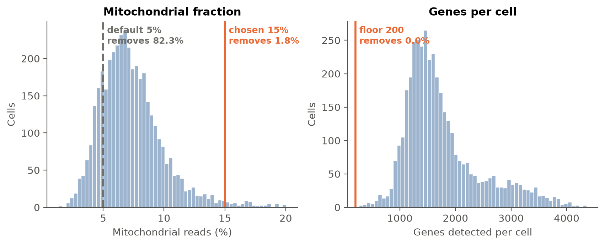
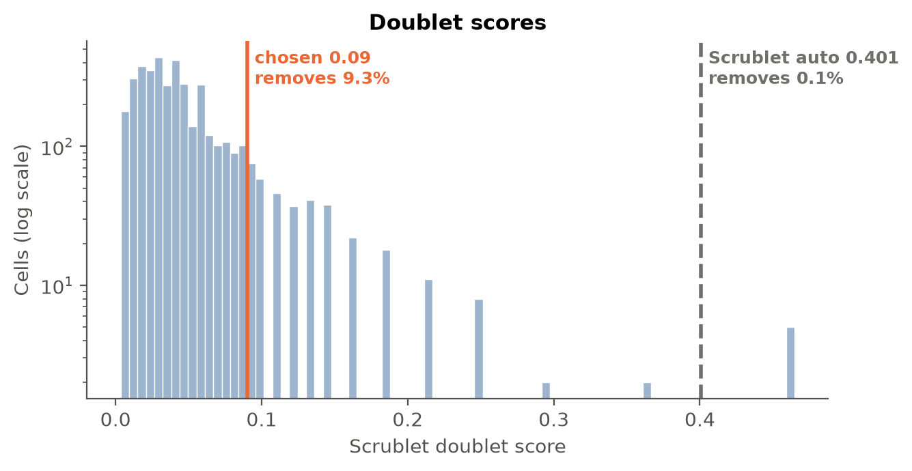
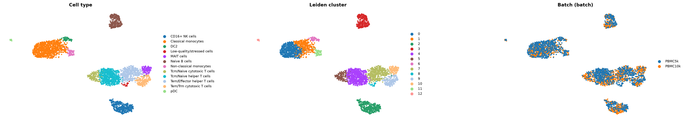
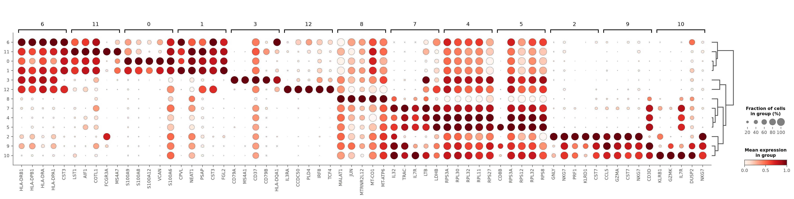
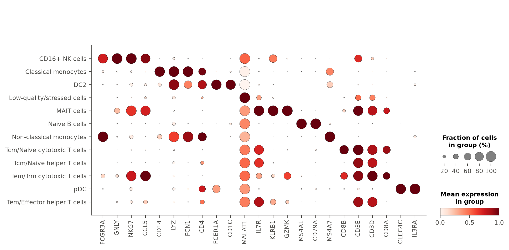
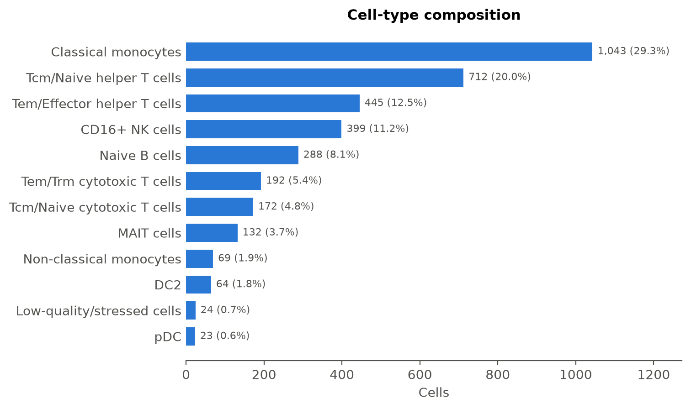
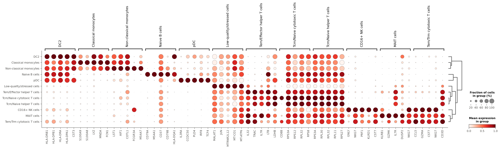

# Single-cell RNA-seq analysis: pbmc_multibatch

**pbmc_multibatch** · 4,000 → 3,563 cells · 13 clusters · 12 cell types · scVI embedding

## Overview

PBMCs from two independent 10x runs (PBMC5k and PBMC10k, `2` batches under obs column `batch`) were combined into one object of `4,000` cells x `15,792` genes and taken from raw counts to annotated cell types. Because the two runs are a technical grouping rather than a biological condition, batch correction was used purely to align cell types for clustering/annotation, while raw counts were preserved throughout.

## Key analysis decisions

Each row compares a standard default with what the agent chose after reading the data. Built from the tool log (`tool_calls.jsonl`), not written by the model, except the relabelling reasons, which quote the agent's tool call.

| Step | Standard default | What the data showed | Agent's choice | Effect |
|---|---|---|---|---|
| Mitochondrial cutoff | 5% | median 6.93%; default would remove 3,291 of 4,000 cells (82.3%) | **15%** (changed) | 73 cells removed by QC (1.8%) |
| Cell and gene floors | ≥200 genes/cell, genes in ≥3 cells | fewest genes in a cell: 264 | ≥200 genes/cell, genes in ≥3 cells (default kept) | 90 genes removed |
| Doublet threshold | Scrublet automatic (0.404 / 0.397 per batch) | scores not bimodal; median + 3×MAD 0.09 | **0.09** (median + 3×MAD) | 364 cells removed (9.27%) |
| Normalisation | 10,000 counts/cell, 2,000 HVGs | — | 10,000 counts/cell, 2,000 HVGs (default kept) | HVGs ranked within each batch ('batch') |
| Embedding | PCA | 2 batches in `obs['batch']` | **scVI**, correcting for batch | 10 latent dimensions, 2 batches |
| Leiden resolution | 1.0 | — | 1.0 (default kept) | 13 clusters |
| Annotation model | Immune_All_Low | — | Immune_All_Low (default kept) | 11 cell types |
| Cluster labels | CellTypist majority vote | Cluster 8 (24 cells) was labeled 'Tcm/Naive helper T cells' by CellTypist, but check_markers shows CD3D and CD3E are not significantly enriched (padj=1.0, ~46% pct in cluster vs ~46-53% elsewhere) and CD14/MS4A1/NKG7 are also non-significant/absent. Its actual top markers are MALAT1, JUN, FOSB, IER2, BTG1 and a stack of mitochondrial transcripts (MT-CO1, MT-ATP6, MT-ND5, MT-CYB, MT-CO3, MT-ND1), a stress/immediate-early signature rather than any lineage program, so it is better labeled a low-quality/stressed population than a T-cell subset. | cluster 8: Tcm/Naive helper T cells → **Low-quality/stressed cells** | 24 cells relabelled |

## Quality control

Gene identifiers were confirmed as human gene symbols with a `MT-` mitochondrial prefix (`13` mitochondrial genes detected), so mitochondrial QC metrics are reliable.

The mitochondrial fraction in this dataset runs noticeably higher than a typical tutorial PBMC sample: median `6.93%`, p75 `8.6%`, p95 `12.2%`, max `20%`. Applying the tutorial-default cap of `5%` would have discarded `3,291` cells (`82.3%` of the dataset) — clearly excessive and indicative of a shifted baseline rather than widespread cell damage. I instead used a permissive cap of `15%`, which trims only the true high-mito outlier tail while keeping the bulk of the biologically real population. The gene-count floor (`200`) removed no cells on its own, since the empirical minimum (`264` genes/cell) already exceeds it — this dataset had no very-low-complexity droplets to begin with. Combined cell filtering removed `73` cells (`1.8%`), and the gene floor (`3` cells/gene) removed `90` lowly-detected genes.

*Per-cell QC before filtering (4,000 cells, median 6.93% mitochondrial). The standard 5% mitochondrial cutoff (dashed) would remove 3,291 cells (82.3%); the chosen 15% cutoff removes 73 (1.8%). Minimum genes per cell: 200, which removes 0 cells (fewest observed: 264).*

## Doublet detection

Scrublet was run separately within each 10x run; the pooled score distribution was `not bimodal`, i.e. no clean bimodal valley to split on. Following the standard rule for data without prior doublet removal, I used median + 3xMAD (`0.09`), which sits well below either run's Scrublet automatic threshold (`0.404 / 0.397`) and flags a plausible `9.27%` of cells as doublets — in line with expected multiplet rates for standard (non-hashed, non-demultiplexed) 10x loading. This removed `364` cells, leaving `3,563`.

*Scrublet doublet scores for 3,927 cells; the distribution is not bimodal. Chosen threshold 0.09 (median + 3×MAD) flags 364 cells (9.3%). The mean of Scrublet's per-batch automatic thresholds (dashed, 0.401) would flag 5.*

## Dimensionality reduction

The two 10x runs are a genuine technical batch (separate captures/libraries), so I used scVI (batch key = `batch`, `10`-dim latent space, `400` epochs) rather than plain PCA. This lets clustering and UMAP reflect shared cell-type structure across runs instead of run-of-origin, while leaving raw counts untouched for any downstream expression analysis.

## Clustering

Leiden clustering on the scVI embedding (resolution `1.0`) yielded `13` clusters, ranging from `23` to `712` cells (see cluster table).

| Cluster | Cells | Top marker genes | Cell type | CellTypist label |
|---|---|---|---|---|
| 0 | 658 | S100A9, S100A8, S100A12, VCAN, S100A6 | Classical monocytes | Classical monocytes |
| 1 | 385 | CPVL, NEAT1, PSAP, CST3, FGL2 | Classical monocytes | Classical monocytes |
| 2 | 399 | GNLY, NKG7, PRF1, KLRD1, CST7 | CD16+ NK cells | CD16+ NK cells |
| 3 | 288 | CD79A, MS4A1, CD37, CD79B, HLA-DQA1 | Naive B cells | Naive B cells |
| 4 | 712 | RPS3A, RPL30, RPL32, RPL11, RPS27 | Tcm/Naive helper T cells | Tcm/Naive helper T cells |
| 5 | 172 | CD8B, RPS3A, RPS12, RPL32, RPS8 | Tcm/Naive cytotoxic T cells | Tcm/Naive cytotoxic T cells |
| 6 | 64 | HLA-DRB1, HLA-DPB1, HLA-DRA, HLA-DPA1, CST3 | DC2 | DC2 |
| 7 | 445 | IL32, TRAC, IL7R, LTB, LDHB | Tem/Effector helper T cells | Tem/Effector helper T cells |
| 8 | 24 | MALAT1, JUN, MTRNR2L12, MT-CO1, MT-ATP6 | **Low-quality/stressed cells** | Tcm/Naive helper T cells |
| 9 | 192 | CCL5, GZMA, CST7, NKG7, CD3D | Tem/Trm cytotoxic T cells | Tem/Trm cytotoxic T cells |
| 10 | 132 | KLRB1, GZMK, IL7R, DUSP2, NKG7 | MAIT cells | MAIT cells |
| 11 | 69 | LST1, AIF1, COTL1, FCGR3A, MS4A7 | Non-classical monocytes | Non-classical monocytes |
| 12 | 23 | IL3RA, CCDC50, PLD4, IRF8, TCF4 | pDC | pDC |

*UMAP of 3,563 cells computed on the scVI latent space, coloured by cell type, Leiden cluster and batch (batch). scVI corrected for batch. Batches that overlap within each cell type indicate the integration worked.*

## Cell-type annotation

CellTypist (Immune_All_Low.pkl, majority-voted per cluster) was used for initial labels, cross-checked against the coarser Immune_All_High.pkl model and against canonical markers verified with `check_markers` (rank among all genes, log2FC, padj, and % expressing in vs. outside the cluster).

- **Classical monocytes** (clusters 0, 1): CD14 and LYZ/FCN1 were top-ranked, strongly significant, and expressed in nearly all cells of both clusters versus a small minority elsewhere — the canonical classical-monocyte profile, corroborated by the S100A8/A9/A12 program in the top markers. Both models agree at the broad ("Monocytes") level.
- **Non-classical monocytes** (cluster 11): FCGR3A and MS4A7 were top-ranked and enriched in nearly the whole cluster, while CD14 showed no significant enrichment — the classic CD16+ monocyte profile, clearly distinct from clusters 0/1.
- **CD16+ NK cells** (cluster 2): GNLY, NKG7 and FCGR3A were the top three ranked genes genome-wide for this cluster, each expressed in nearly all cluster cells and a small minority elsewhere; CD3D/CD3E were not enriched.
- **Naive B cells** (cluster 3): CD79A and MS4A1 were the two top-ranked genes for the cluster, each expressed in nearly all cluster cells and almost none elsewhere.
- **DC2** (cluster 6): FCER1A and CD1C were both highly ranked, strongly enriched, and essentially specific to this cluster, together with high HLA-DR gene expression.
- **pDC** (cluster 12): IL3RA and CLEC4C were the top-ranked genes for the cluster and essentially unique to it (near-zero expression in every other cluster).
- **Tcm/Naive helper T cells** (cluster 4) and **Tem/Effector helper T cells** (cluster 7): both clusters show strong, significant CD3D/CD3E and IL7R enrichment with CD8A/CD8B absent, confirming CD4 T-cell identity at two differentiation states. Cluster 4's top markers being dominated by ribosomal genes is consistent with the smaller transcriptome typical of resting/naive T cells, while cluster 7 carries an activation-associated profile (IL32, LTB).
- **Tcm/Naive cytotoxic T cells** (cluster 5) and **Tem/Trm cytotoxic T cells** (cluster 9): both are CD3D/CD3E-positive with CD8A/CD8B significantly enriched; cluster 9 additionally shows strong CCL5 and GZMK enrichment, marking an effector/memory phenotype versus cluster 5's naive/central-memory profile.
- **MAIT cells** (cluster 10): KLRB1 was the single top-ranked gene and expressed in essentially all cells of the cluster, together with strong GZMK and IL7R enrichment, matching the semi-invariant MAIT signature.
- **Low-quality/stressed cells** (cluster 8, relabeled): CellTypist's label of "Tcm/Naive helper T cells" was not supported by markers — CD3D and CD3E showed no significant enrichment (expression indistinguishable from the rest of the dataset), nor did CD14, MS4A1 or NKG7. Instead, the cluster's actual top-ranked, significantly enriched markers were MALAT1 and a stack of mitochondrial transcripts (MT-CO1 and others), alongside immediate-early genes (JUN, FOSB, IER2) — a stress/dissociation-artifact signature rather than any lineage program, so it was relabeled and should be treated as background rather than a real cell type.

| Cell type | Cells | Share |
|---|---|---|
| Classical monocytes | 1,043 | 29.3% |
| Tcm/Naive helper T cells | 712 | 20.0% |
| Tem/Effector helper T cells | 445 | 12.5% |
| CD16+ NK cells | 399 | 11.2% |
| Naive B cells | 288 | 8.1% |
| Tem/Trm cytotoxic T cells | 192 | 5.4% |
| Tcm/Naive cytotoxic T cells | 172 | 4.8% |
| MAIT cells | 132 | 3.7% |
| Non-classical monocytes | 69 | 1.9% |
| DC2 | 64 | 1.8% |
| Low-quality/stressed cells | 24 | 0.7% |
| pDC | 23 | 0.6% |
| **Total** | **3,563** | |

Final annotated dataset: `3,563` cells across `12` labels, dominated by 1,043 cells (29.3%) classical monocytes and 712 cells (20.0%) naive/central-memory CD4 T cells, with smaller but clearly resolved populations of dendritic cells (64 cells (1.8%) DC2, 23 cells (0.6%) pDC) and the small stressed-cell cluster (24 cells (0.7%)).

*Top 5 marker genes per Leiden cluster (Wilcoxon rank-sum). Dot size: fraction of cells expressing; colour: mean expression scaled per gene.*

*Canonical markers checked by the agent before accepting or changing labels (23 of 24 shown), ordered by the cell type each marks most, so the enriched dots run down the diagonal. A gene is shown if, in at least one type, padj < 0.05, log2FC > 1 and it is expressed in at least 25% of cells. Dot size: fraction of cells expressing; colour: mean expression scaled per gene. Not enriched in any type: MT-CO1.*

*Cells per annotated type (3,563 cells, 12 types; CellTypist majority vote over Leiden clusters, with clusters relabelled by the agent from their markers (see the decisions table)).*

*Top 5 marker genes per cell type (Wilcoxon rank-sum). Dot size: fraction of cells expressing; colour: mean expression scaled per gene.*

## Caveats

- The mitochondrial threshold (`15%`) was chosen specifically for this dataset's shifted mito distribution; it is more permissive than the usual tutorial default and should not be reused unexamined on other data.
- Doublet removal used a global median+3MAD threshold per the standard rule; a small number of borderline cells near the cutoff are inherently ambiguous, and true heterotypic doublets between transcriptionally similar clusters (e.g. the two CD4 T-cell states) may be under-detected.
- Cluster 8 ("Low-quality/stressed cells", 24 cells (0.7%)) shows no coherent marker program and should be excluded from any biological interpretation; it likely reflects a small population of stressed/damaged cells that passed the permissive mito filter.
- scVI batch correction (on `batch`) was used to align cell types across the two 10x runs for clustering; this changes only the embedding used for neighbors/UMAP/clustering, not the raw counts, but any subtle run-specific biological differences could in principle be partially smoothed by the correction.
- No condition comparison (composition or differential expression testing) was performed, since the two batches here are technical replicates (10x runs) of the same PBMC pool rather than distinct biological conditions.

## Conclusions

Standard PBMC lineages were recovered cleanly after batch-aware integration of the two 10x runs: classical and non-classical monocytes, CD16+ NK cells, naive B cells, DC2 and pDC dendritic subsets, and CD4/CD8 T cells spanning naive/central-memory and effector/memory states plus MAIT cells. Every retained label is supported by canonical, statistically enriched markers verified directly against the ranked marker tables; the one CellTypist call not supported by markers (cluster 8) was identified as a stress artifact and relabeled accordingly.

## Methods

*Generated from the tool log: these are the steps and parameters that actually ran.*

**Quality control.** Per-cell metrics were computed with scanpy `calculate_qc_metrics`; mitochondrial genes were those prefixed `MT-` (13 found).

**Filtering.** Cells with fewer than 200 detected genes or more than 15% mitochondrial reads were removed, as were genes detected in fewer than 3 cells (4,000 → 3,927 cells, 15,792 → 15,702 genes).

**Doublets.** Doublet scores were computed with Scrublet (scanpy `pp.scrublet`), run separately within each batch ('batch'), on raw counts; cells scoring ≥ 0.09 were removed (364 cells, 9.27%).

**Normalisation.** Raw counts were kept in `layers['counts']`; expression was scaled to 10,000 counts per cell and log1p-transformed. The top 2,000 highly variable genes were flagged, ranked within each batch ('batch').

**Embedding.** An scVI model (10 latent dimensions, 400 epochs) was trained on raw counts of 2,000 highly variable genes, correcting for batch; its latent space was used for clustering, UMAP and annotation (raw counts were unchanged).

**Clustering.** A k-nearest-neighbour graph on that embedding was clustered with Leiden (resolution 1.0; 13 clusters) and embedded with UMAP.

**Markers and annotation.** Marker genes per cluster were ranked with a Wilcoxon rank-sum test. Cell types were assigned with CellTypist (model `Immune_All_Low.pkl`), using majority voting over the Leiden clusters.

**Label curation.** Where marker genes contradicted CellTypist, the agent relabelled whole clusters (1 clusters; listed in the decisions table with the evidence). The original CellTypist labels are kept in `obs['cell_type_celltypist']`.

### Software

| Software | Version |
|---|---|
| Python | 3.11.14 |
| scanpy | 1.11.5 |
| anndata | 0.12.19 |
| numpy | 2.4.6 |
| scipy | 1.17.1 |
| scvi-tools | 1.4.2 |
| celltypist | 1.7.1 |
| LLM (analysis decisions and narrative) | claude-sonnet-5 |

### Reproducibility

Random seed 0 for all stochastic steps. Every tool call, with the arguments the agent chose and the summary it read back, is in `tool_calls.jsonl`. The agent's choices are sampled from the model, so a re-run can take different decisions.

---

*This report was produced by an AI agent (claude-sonnet-5). The run summary, decisions table, figures, captions and Methods are generated by code from the tool log; the narrative is written by the model and should be checked against them before use.*
